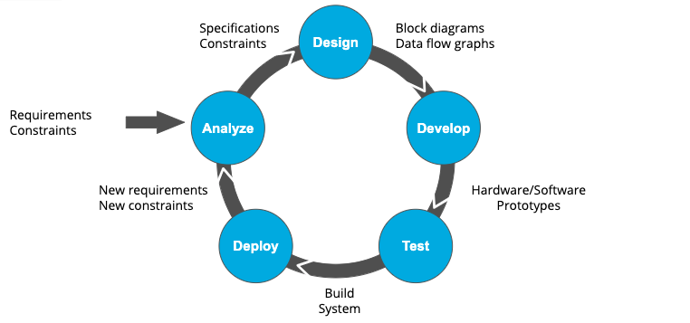
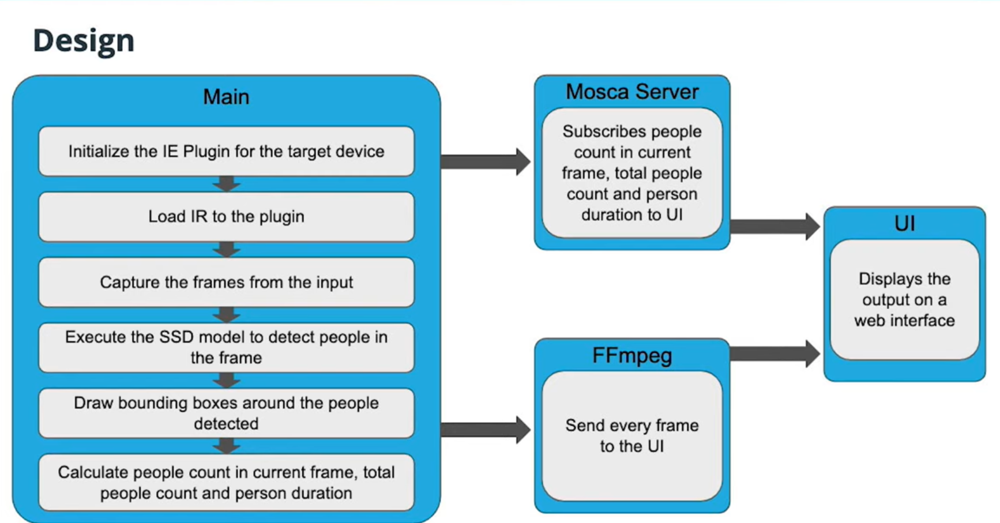
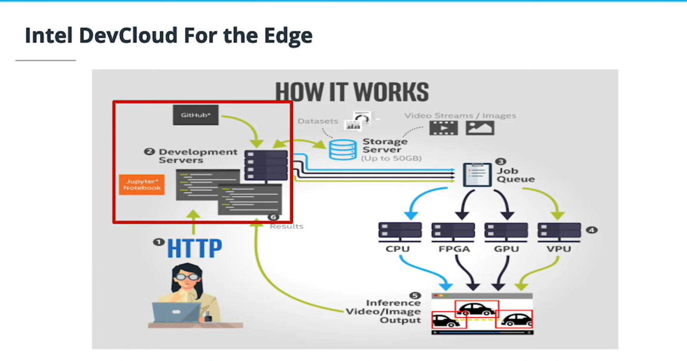

## Basic Approach to Development

### Analyze

In developing an Edge AI system, the first phase is to analyze the problem.

During this phase, you (as the IoT engineer) work with the end-user to understand what they are wanting to do and to get all of the requirements and constraints involved. For example, you might be working with a client who has a self-checkout system at a supermarket. They might be using cameras to record the customers, and want to run inference on the video feed to check that the number of items scanned matches the number of items detected in the video feed, in order to detect possible theft.

The client will have certain constraints—for example, maybe they have four cameras, a limited budget, and a PC running in the office that they can potentially use to do the inference. Understanding all of these needs and constraints is a critical step if you want to present an effective solution to the customer.

A simplified requirement and constraints example is the **People Counter App**.

### Design

In the next stage of the process, you work out the overall design of the system, including the different components and how the data will flow from one to the next. In the **People Counter App** example, we've been discussing, the cameras would be recording video, which would be sent to the edge device where the inference would be run. The output from the edge device might then be sent to a staff member's device to notify them of possible theft.

At this stage, you as the engineer will probably have a good hypothesis about what hardware solution is most appropriate. For example, in the example, maybe you have a guess that the CPU in the client's existing PC will be sufficient. But you don't know for sure until you test it.

### Develop

In the next stage of the process, you'll develop a prototype application, using the OpenVINO Toolkit. You'll select which AI models you think might work best to conduct the inference. And similarly, you'll decide which hardware types are potential candidates.

### Test and Deploy

At this point, you may have a pretty good idea of what hardware you think will work best—but you really can't know until you test it. 

Now that you've tested your design and selected your hardware, the last step is to actually deploy the system for the client. But your work is not over at this point. Despite all of the design work and testing you've done, there will probably be room for improvement based on real-world usage. For example, maybe you thought a fanless, closed CPU system was good—but once the system is actually deployed, discover that the system overheats during the summer months. Based on this data, you can create a revised set of requirements and constraints—and feed this back into the beginning of the development process, analyzing and redesigning to improve the system.

## Basic Terminology

Check *glossary-course-2-choose-the-right-hardware.pdf* for more terms.

## Intel Dev Cloud

The Intel DevCloud is a cloud environment that allows you to build, prototype, and check the performance of your application on several different hardware devices.

There are five main components of the Intel Devcloud for the Edge:

1. **User.** That’s you, connecting via a browser to a development server.
2. **Development Server.** The development server offers Jupyter notebooks, where you can run your program.
3. **Job Queue.** This is where you select the hardware to run your application. In order to request the hardware, you need to submit a job requesting an edge node.
4. **Edge Node.** You can submit your job to a hardware platform containing a specific target architecture or a combination of CPU, GPU, VPU, and FPGA architectures.
5. **Inference Output.** You can view real-time performance results of your jobs as a text file or a real-time annotated video.

